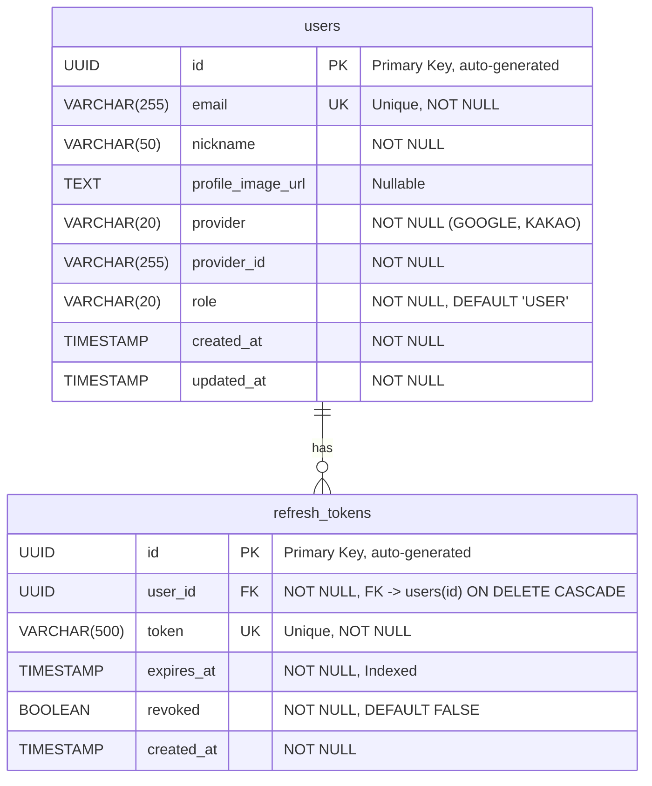

# Budget Book - Entity Relationship Diagram

> Database schema definition for Budget Book.
> All tables use PostgreSQL (hosted on Supabase).
> Migrations are managed via Flyway with `V{N}__` naming convention.

---

## ER Diagram

---

## Table Details

### `users`

Stores user account information from OAuth providers.

| Column              | Type           | Constraints                         | Description                       |
|:--------------------|:---------------|:------------------------------------|:----------------------------------|
| `id`                | `UUID`         | `PK`                               | Auto-generated primary key        |
| `email`             | `VARCHAR(255)` | `UNIQUE NOT NULL`                   | User email from OAuth provider    |
| `nickname`          | `VARCHAR(50)`  | `NOT NULL`                          | Display name                      |
| `profile_image_url` | `TEXT`         | `NULLABLE`                          | Profile image URL from provider   |
| `provider`          | `VARCHAR(20)`  | `NOT NULL`                          | OAuth provider: `GOOGLE`, `KAKAO` |
| `provider_id`       | `VARCHAR(255)` | `NOT NULL`                          | Unique ID from the OAuth provider |
| `role`              | `VARCHAR(20)`  | `NOT NULL DEFAULT 'USER'`           | User role: `USER`, `ADMIN`        |
| `created_at`        | `TIMESTAMP`    | `NOT NULL`                          | Account creation timestamp        |
| `updated_at`        | `TIMESTAMP`    | `NOT NULL`                          | Last update timestamp             |

**Indexes & Constraints**

| Name                             | Type       | Columns                  |
|:---------------------------------|:-----------|:-------------------------|
| `pk_users`                       | Primary Key| `id`                     |
| `uq_users_email`                | Unique     | `email`                  |
| `uq_users_provider_provider_id` | Unique     | `(provider, provider_id)`|

---

### `refresh_tokens`

Stores refresh tokens for JWT authentication. Tokens can be revoked without expiring.

| Column       | Type           | Constraints                              | Description                        |
|:-------------|:---------------|:-----------------------------------------|:-----------------------------------|
| `id`         | `UUID`         | `PK`                                    | Auto-generated primary key         |
| `user_id`    | `UUID`         | `FK NOT NULL`                           | References `users(id)` ON DELETE CASCADE |
| `token`      | `VARCHAR(500)` | `UNIQUE NOT NULL`                       | The refresh token value            |
| `expires_at` | `TIMESTAMP`    | `NOT NULL`                              | Token expiration timestamp         |
| `revoked`    | `BOOLEAN`      | `NOT NULL DEFAULT FALSE`                | Whether the token has been revoked |
| `created_at` | `TIMESTAMP`    | `NOT NULL`                              | Token creation timestamp           |

**Indexes & Constraints**

| Name                          | Type        | Columns      | Notes                          |
|:------------------------------|:------------|:-------------|:-------------------------------|
| `pk_refresh_tokens`           | Primary Key | `id`         |                                |
| `uq_refresh_tokens_token`     | Unique      | `token`      |                                |
| `fk_refresh_tokens_user_id`   | Foreign Key | `user_id`    | References `users(id)` ON DELETE CASCADE |
| `idx_refresh_tokens_user_id`  | Index       | `user_id`    | Fast lookup by user            |
| `idx_refresh_tokens_expires`  | Index       | `expires_at` | Efficient cleanup of expired tokens |

---

## Relationships

| From             | To              | Cardinality | Description                              |
|:-----------------|:----------------|:------------|:-----------------------------------------|
| `users`          | `refresh_tokens`| One-to-Many | A user can have multiple refresh tokens (multi-device support) |
