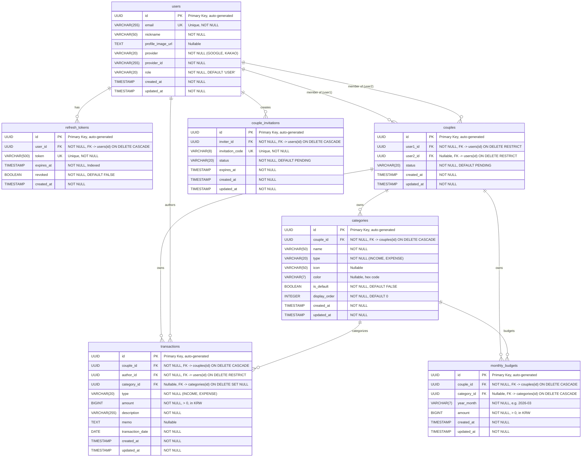

# Budget Book - Entity Relationship Diagram

> Database schema definition for Budget Book.
> All tables use PostgreSQL (hosted on Supabase).
> Migrations are managed via Flyway with `V{N}__` naming convention.

---

## ER Diagram

```mermaid
erDiagram
    users {
        UUID id PK "Primary Key, auto-generated"
        VARCHAR(255) email UK "Unique, NOT NULL"
        VARCHAR(50) nickname "NOT NULL"
        TEXT profile_image_url "Nullable"
        VARCHAR(20) provider "NOT NULL (GOOGLE, KAKAO)"
        VARCHAR(255) provider_id "NOT NULL"
        VARCHAR(20) role "NOT NULL, DEFAULT 'USER'"
        TIMESTAMP created_at "NOT NULL"
        TIMESTAMP updated_at "NOT NULL"
    }

    refresh_tokens {
        UUID id PK "Primary Key, auto-generated"
        UUID user_id FK "NOT NULL, FK -> users(id) ON DELETE CASCADE"
        VARCHAR(500) token UK "Unique, NOT NULL"
        TIMESTAMP expires_at "NOT NULL, Indexed"
        BOOLEAN revoked "NOT NULL, DEFAULT FALSE"
        TIMESTAMP created_at "NOT NULL"
    }

    couples {
        UUID id PK "Primary Key, auto-generated"
        UUID user1_id FK "NOT NULL, FK -> users(id) ON DELETE RESTRICT"
        UUID user2_id FK "Nullable, FK -> users(id) ON DELETE RESTRICT"
        VARCHAR(20) status "NOT NULL, DEFAULT PENDING"
        TIMESTAMP created_at "NOT NULL"
        TIMESTAMP updated_at "NOT NULL"
    }

    couple_invitations {
        UUID id PK "Primary Key, auto-generated"
        UUID inviter_id FK "NOT NULL, FK -> users(id) ON DELETE CASCADE"
        VARCHAR(8) invitation_code UK "Unique, NOT NULL"
        VARCHAR(20) status "NOT NULL, DEFAULT PENDING"
        TIMESTAMP expires_at "NOT NULL"
        TIMESTAMP created_at "NOT NULL"
        TIMESTAMP updated_at "NOT NULL"
    }

    categories {
        UUID id PK "Primary Key, auto-generated"
        UUID couple_id FK "NOT NULL, FK -> couples(id) ON DELETE CASCADE"
        VARCHAR(50) name "NOT NULL"
        VARCHAR(20) type "NOT NULL (INCOME, EXPENSE)"
        VARCHAR(50) icon "Nullable"
        VARCHAR(7) color "Nullable, hex code"
        BOOLEAN is_default "NOT NULL, DEFAULT FALSE"
        INTEGER display_order "NOT NULL, DEFAULT 0"
        TIMESTAMP created_at "NOT NULL"
        TIMESTAMP updated_at "NOT NULL"
    }

    transactions {
        UUID id PK "Primary Key, auto-generated"
        UUID couple_id FK "NOT NULL, FK -> couples(id) ON DELETE CASCADE"
        UUID author_id FK "NOT NULL, FK -> users(id) ON DELETE RESTRICT"
        UUID category_id FK "Nullable, FK -> categories(id) ON DELETE SET NULL"
        VARCHAR(20) type "NOT NULL (INCOME, EXPENSE)"
        BIGINT amount "NOT NULL, > 0, in KRW"
        VARCHAR(255) description "NOT NULL"
        TEXT memo "Nullable"
        DATE transaction_date "NOT NULL"
        TIMESTAMP created_at "NOT NULL"
        TIMESTAMP updated_at "NOT NULL"
    }

    monthly_budgets {
        UUID id PK "Primary Key, auto-generated"
        UUID couple_id FK "NOT NULL, FK -> couples(id) ON DELETE CASCADE"
        UUID category_id FK "Nullable, FK -> categories(id) ON DELETE CASCADE"
        VARCHAR(7) year_month "NOT NULL, e.g. 2026-03"
        BIGINT amount "NOT NULL, > 0, in KRW"
        TIMESTAMP created_at "NOT NULL"
        TIMESTAMP updated_at "NOT NULL"
    }

    users ||--o{ refresh_tokens : "has"
    users ||--o{ couple_invitations : "creates"
    users ||--o{ couples : "member of (user1)"
    users ||--o{ couples : "member of (user2)"
    couples ||--o{ categories : "owns"
    couples ||--o{ transactions : "owns"
    couples ||--o{ monthly_budgets : "owns"
    users ||--o{ transactions : "authors"
    categories ||--o{ transactions : "categorizes"
    categories ||--o{ monthly_budgets : "budgets"
```

---

## Table Details

### `users` (V1)

Stores user account information from OAuth providers.

| Column              | Type           | Constraints                         | Description                       |
|:--------------------|:---------------|:------------------------------------|:----------------------------------|
| `id`                | `UUID`         | `PK`                               | Auto-generated primary key        |
| `email`             | `VARCHAR(255)` | `UNIQUE NOT NULL`                   | User email from OAuth provider    |
| `nickname`          | `VARCHAR(50)`  | `NOT NULL`                          | Display name                      |
| `profile_image_url` | `TEXT`         | `NULLABLE`                          | Profile image URL from provider   |
| `provider`          | `VARCHAR(20)`  | `NOT NULL`                          | OAuth provider: `GOOGLE`, `KAKAO` |
| `provider_id`       | `VARCHAR(255)` | `NOT NULL`                          | Unique ID from the OAuth provider |
| `role`              | `VARCHAR(20)`  | `NOT NULL DEFAULT 'USER'`           | User role: `USER`, `ADMIN`        |
| `created_at`        | `TIMESTAMPTZ`  | `NOT NULL`                          | Account creation timestamp        |
| `updated_at`        | `TIMESTAMPTZ`  | `NOT NULL`                          | Last update timestamp             |

**Indexes & Constraints**

| Name                             | Type        | Columns                   |
|:---------------------------------|:------------|:--------------------------|
| `pk_users`                       | Primary Key | `id`                      |
| `uk_users_email`                 | Unique      | `email`                   |
| `uk_users_provider_provider_id`  | Unique      | `(provider, provider_id)` |
| `idx_users_provider`             | Index       | `provider`                |

---

### `refresh_tokens` (V2)

Stores refresh tokens for JWT authentication. Tokens can be revoked without expiring.

| Column       | Type           | Constraints                              | Description                        |
|:-------------|:---------------|:-----------------------------------------|:-----------------------------------|
| `id`         | `UUID`         | `PK`                                    | Auto-generated primary key         |
| `user_id`    | `UUID`         | `FK NOT NULL`                           | References `users(id)` ON DELETE CASCADE |
| `token`      | `VARCHAR(500)` | `UNIQUE NOT NULL`                       | The refresh token value            |
| `expires_at` | `TIMESTAMPTZ`  | `NOT NULL`                              | Token expiration timestamp         |
| `revoked`    | `BOOLEAN`      | `NOT NULL DEFAULT FALSE`                | Whether the token has been revoked |
| `created_at` | `TIMESTAMPTZ`  | `NOT NULL`                              | Token creation timestamp           |

**Indexes & Constraints**

| Name                          | Type        | Columns      |
|:------------------------------|:------------|:-------------|
| `pk_refresh_tokens`           | Primary Key | `id`         |
| `uk_refresh_tokens_token`     | Unique      | `token`      |
| `fk_refresh_tokens_user_id`   | Foreign Key | `user_id`    |
| `idx_refresh_tokens_user_id`  | Index       | `user_id`    |
| `idx_refresh_tokens_expires_at` | Index     | `expires_at` |

---

### `couples` (V3)

Represents the relationship between two users. A couple can be in `PENDING` state (invitation sent, partner not yet accepted) or `ACTIVE` (both users linked).

| Column      | Type          | Constraints              | Description                                    |
|:------------|:--------------|:-------------------------|:-----------------------------------------------|
| `id`        | `UUID`        | `PK`                    | Auto-generated primary key                     |
| `user1_id`  | `UUID`        | `FK NOT NULL`           | Inviting user — references `users(id)`         |
| `user2_id`  | `UUID`        | `FK NULLABLE`           | Accepting user — references `users(id)`; set on acceptance |
| `status`    | `VARCHAR(20)` | `NOT NULL DEFAULT 'PENDING'` | `PENDING`, `ACTIVE`, `DISSOLVED`          |
| `created_at`| `TIMESTAMPTZ` | `NOT NULL`              | Couple creation timestamp                      |
| `updated_at`| `TIMESTAMPTZ` | `NOT NULL`              | Last status change timestamp                   |

**Check Constraints**: `status IN ('PENDING','ACTIVE','DISSOLVED')`, `user1_id <> user2_id`

**Indexes**

| Name                    | Type  | Columns    |
|:------------------------|:------|:-----------|
| `idx_couples_user1_id`  | Index | `user1_id` |
| `idx_couples_user2_id`  | Index | `user2_id` |

---

### `couple_invitations` (V3)

Stores short-lived invitation codes used for couple linking.

| Column            | Type          | Constraints              | Description                              |
|:------------------|:--------------|:-------------------------|:-----------------------------------------|
| `id`              | `UUID`        | `PK`                    | Auto-generated primary key               |
| `inviter_id`      | `UUID`        | `FK NOT NULL`           | References `users(id)` ON DELETE CASCADE |
| `invitation_code` | `VARCHAR(8)`  | `UNIQUE NOT NULL`       | 8-char alphanumeric code                 |
| `status`          | `VARCHAR(20)` | `NOT NULL DEFAULT 'PENDING'` | `PENDING`, `ACCEPTED`, `EXPIRED`, `CANCELLED` |
| `expires_at`      | `TIMESTAMPTZ` | `NOT NULL`              | Code expiry (24h after creation)         |
| `created_at`      | `TIMESTAMPTZ` | `NOT NULL`              | Creation timestamp                       |
| `updated_at`      | `TIMESTAMPTZ` | `NOT NULL`              | Last status change timestamp             |

**Indexes**

| Name                                    | Type   | Columns           |
|:----------------------------------------|:-------|:------------------|
| `uk_couple_invitations_code`            | Unique | `invitation_code` |
| `idx_couple_invitations_inviter_id`     | Index  | `inviter_id`      |
| `idx_couple_invitations_expires_at`     | Index  | `expires_at`      |

---

### `categories` (V4)

Couple-scoped categories for classifying transactions. Each couple gets a set of default categories seeded on couple activation.

| Column          | Type          | Constraints              | Description                                |
|:----------------|:--------------|:-------------------------|:-------------------------------------------|
| `id`            | `UUID`        | `PK`                    | Auto-generated primary key                 |
| `couple_id`     | `UUID`        | `FK NOT NULL`           | References `couples(id)` ON DELETE CASCADE |
| `name`          | `VARCHAR(50)` | `NOT NULL`              | Category display name                      |
| `type`          | `VARCHAR(20)` | `NOT NULL`              | `INCOME` or `EXPENSE`                      |
| `icon`          | `VARCHAR(50)` | `NULLABLE`              | Material icon name                         |
| `color`         | `VARCHAR(7)`  | `NULLABLE`              | Hex color code (e.g. `#FF5733`)            |
| `is_default`    | `BOOLEAN`     | `NOT NULL DEFAULT FALSE`| System default — cannot be deleted         |
| `display_order` | `INTEGER`     | `NOT NULL DEFAULT 0`    | Sort order within type group               |
| `created_at`    | `TIMESTAMPTZ` | `NOT NULL`              | Creation timestamp                         |
| `updated_at`    | `TIMESTAMPTZ` | `NOT NULL`              | Last update timestamp                      |

**Check Constraints**: `type IN ('INCOME','EXPENSE')`

**Indexes**

| Name                            | Type  | Columns              |
|:--------------------------------|:------|:---------------------|
| `idx_categories_couple_id`      | Index | `couple_id`          |
| `idx_categories_couple_type`    | Index | `(couple_id, type)`  |

**Default Categories (seeded on couple activation)**

| Name       | Type    | Icon             | Color     |
|:-----------|:--------|:-----------------|:----------|
| 급여       | INCOME  | payments         | #4CAF50   |
| 부업/용돈   | INCOME  | attach_money     | #8BC34A   |
| 식비       | EXPENSE | restaurant       | #FF5733   |
| 교통비     | EXPENSE | directions_car   | #2196F3   |
| 쇼핑       | EXPENSE | shopping_bag     | #9C27B0   |
| 의료/건강  | EXPENSE | local_hospital   | #F44336   |
| 문화/여가  | EXPENSE | movie            | #FF9800   |
| 기타       | EXPENSE | more_horiz       | #9E9E9E   |

---

### `transactions` (V5)

Individual income and expense records belonging to a couple.

| Column             | Type          | Constraints                          | Description                                          |
|:-------------------|:--------------|:-------------------------------------|:-----------------------------------------------------|
| `id`               | `UUID`        | `PK`                                | Auto-generated primary key                           |
| `couple_id`        | `UUID`        | `FK NOT NULL`                       | References `couples(id)` ON DELETE CASCADE           |
| `author_id`        | `UUID`        | `FK NOT NULL`                       | References `users(id)` ON DELETE RESTRICT            |
| `category_id`      | `UUID`        | `FK NULLABLE`                       | References `categories(id)` ON DELETE SET NULL       |
| `type`             | `VARCHAR(20)` | `NOT NULL`                          | `INCOME` or `EXPENSE`                                |
| `amount`           | `BIGINT`      | `NOT NULL CHECK (amount > 0)`       | Amount in KRW (Korean Won, no decimals)              |
| `description`      | `VARCHAR(255)`| `NOT NULL`                          | Short description                                    |
| `memo`             | `TEXT`        | `NULLABLE`                          | Optional longer note                                 |
| `transaction_date` | `DATE`        | `NOT NULL`                          | The date the transaction occurred                    |
| `created_at`       | `TIMESTAMPTZ` | `NOT NULL`                          | Record creation timestamp                            |
| `updated_at`       | `TIMESTAMPTZ` | `NOT NULL`                          | Last update timestamp                                |

**Check Constraints**: `type IN ('INCOME','EXPENSE')`, `amount > 0`

**Indexes**

| Name                              | Type  | Columns                          |
|:----------------------------------|:------|:---------------------------------|
| `idx_transactions_couple_id`      | Index | `couple_id`                      |
| `idx_transactions_couple_date`    | Index | `(couple_id, transaction_date DESC)` |
| `idx_transactions_couple_type`    | Index | `(couple_id, type)`              |
| `idx_transactions_category_id`    | Index | `category_id`                    |
| `idx_transactions_author_id`      | Index | `author_id`                      |

### `monthly_budgets` (V6)

Monthly budget targets per couple, optionally scoped to a category. A `null` `category_id` represents a total monthly budget for the couple.

| Column        | Type          | Constraints                               | Description                                              |
|:--------------|:--------------|:------------------------------------------|:---------------------------------------------------------|
| `id`          | `UUID`        | `PK`                                     | Auto-generated primary key                               |
| `couple_id`   | `UUID`        | `FK NOT NULL`                            | References `couples(id)` ON DELETE CASCADE               |
| `category_id` | `UUID`        | `FK NULLABLE`                            | References `categories(id)` ON DELETE CASCADE; null = total budget |
| `year_month`  | `VARCHAR(7)`  | `NOT NULL`                               | Target month in `YYYY-MM` format (e.g., `2026-03`)       |
| `amount`      | `BIGINT`      | `NOT NULL CHECK (amount > 0)`            | Budget amount in KRW (Korean Won, no decimals)           |
| `created_at`  | `TIMESTAMPTZ` | `NOT NULL`                               | Record creation timestamp                                |
| `updated_at`  | `TIMESTAMPTZ` | `NOT NULL`                               | Last update timestamp                                    |

**Check Constraints**: `amount > 0`

**Indexes & Constraints**

| Name                                          | Type   | Columns                                                                |
|:----------------------------------------------|:-------|:-----------------------------------------------------------------------|
| `uk_monthly_budgets_couple_category_month`    | Unique | `(couple_id, COALESCE(category_id, '00000000-...'), year_month)`       |
| `idx_monthly_budgets_couple_id`               | Index  | `couple_id`                                                            |
| `idx_monthly_budgets_couple_month`            | Index  | `(couple_id, year_month)`                                              |
| `idx_monthly_budgets_category_id`             | Index  | `category_id`                                                          |

---

## Relationships

| From                 | To                   | Cardinality | Description                                               |
|:---------------------|:---------------------|:------------|:----------------------------------------------------------|
| `users`              | `refresh_tokens`     | One-to-Many | A user can have multiple refresh tokens (multi-device)    |
| `users`              | `couple_invitations` | One-to-Many | A user can create multiple invitation codes over time     |
| `users`              | `couples`            | Many-to-Many| A user belongs to at most one ACTIVE couple at a time     |
| `couples`            | `categories`         | One-to-Many | A couple owns all their categories                        |
| `couples`            | `transactions`       | One-to-Many | A couple owns all their transactions                      |
| `couples`            | `monthly_budgets`    | One-to-Many | A couple owns all their monthly budgets                   |
| `users`              | `transactions`       | One-to-Many | A user authors transactions on behalf of the couple       |
| `categories`         | `transactions`       | One-to-Many | Transactions are categorized (category_id can be null)    |
| `categories`         | `monthly_budgets`    | One-to-Many | Budgets are optionally scoped to a category (can be null) |

---

## Migration History

| Version | File                                        | Description                          |
|:--------|:--------------------------------------------|:-------------------------------------|
| V1      | `V1__create_users_table.sql`                | Users table for OAuth accounts       |
| V2      | `V2__create_refresh_tokens_table.sql`       | Refresh tokens for JWT auth          |
| V3      | `V3__create_couples_table.sql`              | Couples + invitation codes           |
| V4      | `V4__create_categories_table.sql`           | Categories per couple                |
| V5      | `V5__create_transactions_table.sql`         | Income/expense transactions          |
| V6      | `V6__create_monthly_budgets_table.sql`      | Monthly budget planning per couple   |
