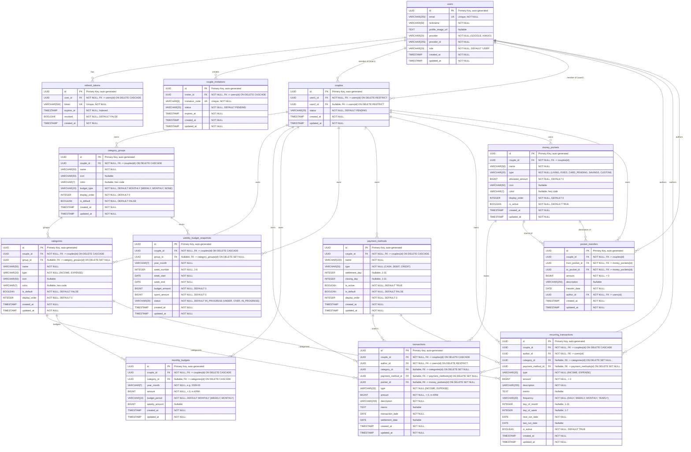

# Budget Book - Entity Relationship Diagram

> Database schema definition for Budget Book.
> PostgreSQL 16, self-hosted on the Synology NAS (`db_postgres_bb`, internal port 5433).
> (Supabase 는 2026 상반기에 NAS 로 이전 완료 — 더 이상 사용하지 않는다.)
> Migrations are managed via Flyway with `V{N}__` naming convention.
>
> **문서 범위 주의 (2026-07-27 감사)**: 아래 `## Table Details` 의 상세 표는 V12 까지만
> 작성되어 있었고 V13 이후 추가된 테이블·컬럼이 빠져 있었다. 그 공백은
> [§ V13~V65 스키마 증분](#v13v65-스키마-증분) 에 정리했다. 신규 마이그레이션을 작성할 때는
> **반드시 두 절을 함께** 확인할 것 (누락된 CHECK/UNIQUE 제약을 모른 채 작성하면
> prod 에서 제약 위반이 난다 — 과거 실제 사고).
>
> 마지막 검증: 2026-07-27, 라이브 DB `flyway_schema_history` 최신 = V64 (전건 success).

---

## ER Diagram

```mermaid
erDiagram
    users {
        UUID id PK "Primary Key, auto-generated"
        VARCHAR(255) email UK "Unique, NOT NULL"
        VARCHAR(50) nickname "NOT NULL"
        TEXT profile_image_url "Nullable"
        VARCHAR(20) provider "NOT NULL (GOOGLE, KAKAO)"
        VARCHAR(255) provider_id "NOT NULL"
        VARCHAR(20) role "NOT NULL, DEFAULT 'USER'"
        TIMESTAMP created_at "NOT NULL"
        TIMESTAMP updated_at "NOT NULL"
    }

    refresh_tokens {
        UUID id PK "Primary Key, auto-generated"
        UUID user_id FK "NOT NULL, FK -> users(id) ON DELETE CASCADE"
        VARCHAR(500) token UK "Unique, NOT NULL"
        TIMESTAMP expires_at "NOT NULL, Indexed"
        BOOLEAN revoked "NOT NULL, DEFAULT FALSE"
        TIMESTAMP created_at "NOT NULL"
    }

    couples {
        UUID id PK "Primary Key, auto-generated"
        UUID user1_id FK "NOT NULL, FK -> users(id) ON DELETE RESTRICT"
        UUID user2_id FK "Nullable, FK -> users(id) ON DELETE RESTRICT"
        VARCHAR(20) status "NOT NULL, DEFAULT PENDING"
        TIMESTAMP created_at "NOT NULL"
        TIMESTAMP updated_at "NOT NULL"
    }

    couple_invitations {
        UUID id PK "Primary Key, auto-generated"
        UUID inviter_id FK "NOT NULL, FK -> users(id) ON DELETE CASCADE"
        VARCHAR(8) invitation_code UK "Unique, NOT NULL"
        VARCHAR(20) status "NOT NULL, DEFAULT PENDING"
        TIMESTAMP expires_at "NOT NULL"
        TIMESTAMP created_at "NOT NULL"
        TIMESTAMP updated_at "NOT NULL"
    }

    category_groups {
        UUID id PK "Primary Key, auto-generated"
        UUID couple_id FK "NOT NULL, FK -> couples(id) ON DELETE CASCADE"
        VARCHAR(50) name "NOT NULL"
        VARCHAR(50) icon "Nullable"
        VARCHAR(7) color "Nullable, hex code"
        VARCHAR(20) budget_type "NOT NULL, DEFAULT MONTHLY (WEEKLY, MONTHLY, NONE)"
        INTEGER display_order "NOT NULL, DEFAULT 0"
        BOOLEAN is_default "NOT NULL, DEFAULT FALSE"
        TIMESTAMP created_at "NOT NULL"
        TIMESTAMP updated_at "NOT NULL"
    }

    categories {
        UUID id PK "Primary Key, auto-generated"
        UUID couple_id FK "NOT NULL, FK -> couples(id) ON DELETE CASCADE"
        UUID group_id FK "Nullable, FK -> category_groups(id) ON DELETE SET NULL"
        VARCHAR(50) name "NOT NULL"
        VARCHAR(20) type "NOT NULL (INCOME, EXPENSE)"
        VARCHAR(50) icon "Nullable"
        VARCHAR(7) color "Nullable, hex code"
        BOOLEAN is_default "NOT NULL, DEFAULT FALSE"
        INTEGER display_order "NOT NULL, DEFAULT 0"
        TIMESTAMP created_at "NOT NULL"
        TIMESTAMP updated_at "NOT NULL"
    }

    payment_methods {
        UUID id PK "Primary Key, auto-generated"
        UUID couple_id FK "NOT NULL, FK -> couples(id) ON DELETE CASCADE"
        VARCHAR(100) name "NOT NULL"
        VARCHAR(20) type "NOT NULL (CASH, DEBIT, CREDIT)"
        INTEGER settlement_day "Nullable, 1-31"
        INTEGER closing_day "Nullable, 1-31"
        BOOLEAN is_active "NOT NULL, DEFAULT TRUE"
        BOOLEAN is_default "NOT NULL, DEFAULT FALSE"
        INTEGER display_order "NOT NULL, DEFAULT 0"
        TIMESTAMP created_at "NOT NULL"
        TIMESTAMP updated_at "NOT NULL"
    }

    transactions {
        UUID id PK "Primary Key, auto-generated"
        UUID couple_id FK "NOT NULL, FK -> couples(id) ON DELETE CASCADE"
        UUID author_id FK "NOT NULL, FK -> users(id) ON DELETE RESTRICT"
        UUID category_id FK "Nullable, FK -> categories(id) ON DELETE SET NULL"
        UUID payment_method_id FK "Nullable, FK -> payment_methods(id) ON DELETE SET NULL"
        UUID pocket_id FK "Nullable, FK -> money_pockets(id) ON DELETE SET NULL"
        VARCHAR(20) type "NOT NULL (INCOME, EXPENSE)"
        BIGINT amount "NOT NULL, > 0, in KRW"
        VARCHAR(255) description "NOT NULL"
        TEXT memo "Nullable"
        DATE transaction_date "NOT NULL"
        DATE settlement_date "Nullable"
        TIMESTAMP created_at "NOT NULL"
        TIMESTAMP updated_at "NOT NULL"
    }

    monthly_budgets {
        UUID id PK "Primary Key, auto-generated"
        UUID couple_id FK "NOT NULL, FK -> couples(id) ON DELETE CASCADE"
        UUID category_id FK "Nullable, FK -> categories(id) ON DELETE CASCADE"
        VARCHAR(7) year_month "NOT NULL, e.g. 2026-03"
        BIGINT amount "NOT NULL, > 0, in KRW"
        VARCHAR(10) budget_period "NOT NULL, DEFAULT MONTHLY (WEEKLY, MONTHLY)"
        BIGINT weekly_amount "Nullable"
        TIMESTAMP created_at "NOT NULL"
        TIMESTAMP updated_at "NOT NULL"
    }

    weekly_budget_snapshots {
        UUID id PK "Primary Key, auto-generated"
        UUID couple_id FK "NOT NULL, FK -> couples(id) ON DELETE CASCADE"
        UUID group_id FK "Nullable, FK -> category_groups(id) ON DELETE SET NULL"
        VARCHAR(7) year_month "NOT NULL"
        INTEGER week_number "NOT NULL, 1-6"
        DATE week_start "NOT NULL"
        DATE week_end "NOT NULL"
        BIGINT budget_amount "NOT NULL, DEFAULT 0"
        BIGINT spent_amount "NOT NULL, DEFAULT 0"
        VARCHAR(20) status "NOT NULL, DEFAULT IN_PROGRESS (UNDER, OVER, IN_PROGRESS)"
        TIMESTAMP created_at "NOT NULL"
        TIMESTAMP updated_at "NOT NULL"
    }

    recurring_transactions {
        UUID id PK "Primary Key, auto-generated"
        UUID couple_id FK "NOT NULL, FK -> couples(id) ON DELETE CASCADE"
        UUID author_id FK "NOT NULL, FK -> users(id)"
        UUID category_id FK "Nullable, FK -> categories(id) ON DELETE SET NULL"
        UUID payment_method_id FK "Nullable, FK -> payment_methods(id) ON DELETE SET NULL"
        VARCHAR(20) type "NOT NULL (INCOME, EXPENSE)"
        BIGINT amount "NOT NULL, > 0"
        VARCHAR(255) description "NOT NULL"
        TEXT memo "Nullable"
        VARCHAR(20) frequency "NOT NULL (DAILY, WEEKLY, MONTHLY, YEARLY)"
        INTEGER day_of_month "Nullable, 1-31"
        INTEGER day_of_week "Nullable, 1-7"
        DATE next_run_date "NOT NULL"
        DATE last_run_date "Nullable"
        BOOLEAN is_active "NOT NULL, DEFAULT TRUE"
        TIMESTAMP created_at "NOT NULL"
        TIMESTAMP updated_at "NOT NULL"
    }

    money_pockets {
        UUID id PK "Primary Key, auto-generated"
        UUID couple_id FK "NOT NULL, FK -> couples(id)"
        VARCHAR(50) name "NOT NULL"
        VARCHAR(20) type "NOT NULL (LIVING, FIXED, CARD_PENDING, SAVINGS, CUSTOM)"
        BIGINT allocated_amount "NOT NULL, DEFAULT 0"
        VARCHAR(50) icon "Nullable"
        VARCHAR(7) color "Nullable, hex code"
        INTEGER display_order "NOT NULL, DEFAULT 0"
        BOOLEAN is_active "NOT NULL, DEFAULT TRUE"
        TIMESTAMP created_at "NOT NULL"
        TIMESTAMP updated_at "NOT NULL"
    }

    pocket_transfers {
        UUID id PK "Primary Key, auto-generated"
        UUID couple_id FK "NOT NULL, FK -> couples(id)"
        UUID from_pocket_id FK "NOT NULL, FK -> money_pockets(id)"
        UUID to_pocket_id FK "NOT NULL, FK -> money_pockets(id)"
        BIGINT amount "NOT NULL, > 0"
        VARCHAR(255) description "Nullable"
        DATE transfer_date "NOT NULL"
        UUID author_id FK "NOT NULL, FK -> users(id)"
        TIMESTAMP created_at "NOT NULL"
        TIMESTAMP updated_at "NOT NULL"
    }

    users ||--o{ refresh_tokens : "has"
    users ||--o{ couple_invitations : "creates"
    users ||--o{ couples : "member of (user1)"
    users ||--o{ couples : "member of (user2)"
    couples ||--o{ category_groups : "owns"
    couples ||--o{ categories : "owns"
    couples ||--o{ transactions : "owns"
    couples ||--o{ monthly_budgets : "owns"
    couples ||--o{ weekly_budget_snapshots : "owns"
    couples ||--o{ payment_methods : "owns"
    couples ||--o{ recurring_transactions : "owns"
    couples ||--o{ money_pockets : "owns"
    couples ||--o{ pocket_transfers : "owns"
    users ||--o{ transactions : "authors"
    users ||--o{ recurring_transactions : "authors"
    users ||--o{ pocket_transfers : "authors"
    category_groups ||--o{ categories : "groups"
    category_groups ||--o{ weekly_budget_snapshots : "tracks"
    categories ||--o{ transactions : "categorizes"
    categories ||--o{ monthly_budgets : "budgets"
    categories ||--o{ recurring_transactions : "categorizes"
    payment_methods ||--o{ transactions : "used in"
    payment_methods ||--o{ recurring_transactions : "used in"
    money_pockets ||--o{ transactions : "tracks"
    money_pockets ||--o{ pocket_transfers : "source of"
    money_pockets ||--o{ pocket_transfers : "destination of"
```

---

## Table Details

### `users` (V1)

Stores user account information from OAuth providers.

| Column              | Type           | Constraints                         | Description                       |
|:--------------------|:---------------|:------------------------------------|:----------------------------------|
| `id`                | `UUID`         | `PK`                               | Auto-generated primary key        |
| `email`             | `VARCHAR(255)` | `UNIQUE NOT NULL`                   | User email from OAuth provider    |
| `nickname`          | `VARCHAR(50)`  | `NOT NULL`                          | Display name                      |
| `profile_image_url` | `TEXT`         | `NULLABLE`                          | Profile image URL from provider   |
| `provider`          | `VARCHAR(20)`  | `NOT NULL`                          | OAuth provider: `GOOGLE`, `KAKAO` |
| `provider_id`       | `VARCHAR(255)` | `NOT NULL`                          | Unique ID from the OAuth provider |
| `role`              | `VARCHAR(20)`  | `NOT NULL DEFAULT 'USER'`           | User role: `USER`, `ADMIN`        |
| `created_at`        | `TIMESTAMPTZ`  | `NOT NULL`                          | Account creation timestamp        |
| `updated_at`        | `TIMESTAMPTZ`  | `NOT NULL`                          | Last update timestamp             |

**Indexes & Constraints**

| Name                             | Type        | Columns                   |
|:---------------------------------|:------------|:--------------------------|
| `pk_users`                       | Primary Key | `id`                      |
| `uk_users_email`                 | Unique      | `email`                   |
| `uk_users_provider_provider_id`  | Unique      | `(provider, provider_id)` |
| `idx_users_provider`             | Index       | `provider`                |

---

### `refresh_tokens` (V2)

Stores refresh tokens for JWT authentication. Tokens can be revoked without expiring.

| Column       | Type           | Constraints                              | Description                        |
|:-------------|:---------------|:-----------------------------------------|:-----------------------------------|
| `id`         | `UUID`         | `PK`                                    | Auto-generated primary key         |
| `user_id`    | `UUID`         | `FK NOT NULL`                           | References `users(id)` ON DELETE CASCADE |
| `token`      | `VARCHAR(500)` | `UNIQUE NOT NULL`                       | The refresh token value            |
| `expires_at` | `TIMESTAMPTZ`  | `NOT NULL`                              | Token expiration timestamp         |
| `revoked`    | `BOOLEAN`      | `NOT NULL DEFAULT FALSE`                | Whether the token has been revoked |
| `created_at` | `TIMESTAMPTZ`  | `NOT NULL`                              | Token creation timestamp           |

**Indexes & Constraints**

| Name                          | Type        | Columns      |
|:------------------------------|:------------|:-------------|
| `pk_refresh_tokens`           | Primary Key | `id`         |
| `uk_refresh_tokens_token`     | Unique      | `token`      |
| `fk_refresh_tokens_user_id`   | Foreign Key | `user_id`    |
| `idx_refresh_tokens_user_id`  | Index       | `user_id`    |
| `idx_refresh_tokens_expires_at` | Index     | `expires_at` |

---

### `couples` (V3)

Represents the relationship between two users. A couple can be in `PENDING` state (invitation sent, partner not yet accepted) or `ACTIVE` (both users linked).

| Column      | Type          | Constraints              | Description                                    |
|:------------|:--------------|:-------------------------|:-----------------------------------------------|
| `id`        | `UUID`        | `PK`                    | Auto-generated primary key                     |
| `user1_id`  | `UUID`        | `FK NOT NULL`           | Inviting user — references `users(id)`         |
| `user2_id`  | `UUID`        | `FK NULLABLE`           | Accepting user — references `users(id)`; set on acceptance |
| `status`    | `VARCHAR(20)` | `NOT NULL DEFAULT 'PENDING'` | `PENDING`, `ACTIVE`, `DISSOLVED`          |
| `created_at`| `TIMESTAMPTZ` | `NOT NULL`              | Couple creation timestamp                      |
| `updated_at`| `TIMESTAMPTZ` | `NOT NULL`              | Last status change timestamp                   |

**Check Constraints**: `status IN ('PENDING','ACTIVE','DISSOLVED')`, `user1_id <> user2_id`

**Indexes**

| Name                    | Type  | Columns    |
|:------------------------|:------|:-----------|
| `idx_couples_user1_id`  | Index | `user1_id` |
| `idx_couples_user2_id`  | Index | `user2_id` |

---

### `couple_invitations` (V3)

Stores short-lived invitation codes used for couple linking.

| Column            | Type          | Constraints              | Description                              |
|:------------------|:--------------|:-------------------------|:-----------------------------------------|
| `id`              | `UUID`        | `PK`                    | Auto-generated primary key               |
| `inviter_id`      | `UUID`        | `FK NOT NULL`           | References `users(id)` ON DELETE CASCADE |
| `invitation_code` | `VARCHAR(8)`  | `UNIQUE NOT NULL`       | 8-char alphanumeric code                 |
| `status`          | `VARCHAR(20)` | `NOT NULL DEFAULT 'PENDING'` | `PENDING`, `ACCEPTED`, `EXPIRED`, `CANCELLED` |
| `expires_at`      | `TIMESTAMPTZ` | `NOT NULL`              | Code expiry (24h after creation)         |
| `created_at`      | `TIMESTAMPTZ` | `NOT NULL`              | Creation timestamp                       |
| `updated_at`      | `TIMESTAMPTZ` | `NOT NULL`              | Last status change timestamp             |

**Indexes**

| Name                                    | Type   | Columns           |
|:----------------------------------------|:-------|:------------------|
| `uk_couple_invitations_code`            | Unique | `invitation_code` |
| `idx_couple_invitations_inviter_id`     | Index  | `inviter_id`      |
| `idx_couple_invitations_expires_at`     | Index  | `expires_at`      |

---

### `categories` (V4)

Couple-scoped categories for classifying transactions. Each couple gets a set of default categories seeded on couple activation.

| Column          | Type          | Constraints              | Description                                |
|:----------------|:--------------|:-------------------------|:-------------------------------------------|
| `id`            | `UUID`        | `PK`                    | Auto-generated primary key                 |
| `couple_id`     | `UUID`        | `FK NOT NULL`           | References `couples(id)` ON DELETE CASCADE |
| `name`          | `VARCHAR(50)` | `NOT NULL`              | Category display name                      |
| `type`          | `VARCHAR(20)` | `NOT NULL`              | `INCOME` or `EXPENSE`                      |
| `icon`          | `VARCHAR(50)` | `NULLABLE`              | Material icon name                         |
| `color`         | `VARCHAR(7)`  | `NULLABLE`              | Hex color code (e.g. `#FF5733`)            |
| `is_default`    | `BOOLEAN`     | `NOT NULL DEFAULT FALSE`| System default — cannot be deleted         |
| `display_order` | `INTEGER`     | `NOT NULL DEFAULT 0`    | Sort order within type group               |
| `created_at`    | `TIMESTAMPTZ` | `NOT NULL`              | Creation timestamp                         |
| `updated_at`    | `TIMESTAMPTZ` | `NOT NULL`              | Last update timestamp                      |

**Check Constraints**: `type IN ('INCOME','EXPENSE')`

**Indexes**

| Name                            | Type  | Columns              |
|:--------------------------------|:------|:---------------------|
| `idx_categories_couple_id`      | Index | `couple_id`          |
| `idx_categories_couple_type`    | Index | `(couple_id, type)`  |

**Default Categories (seeded on couple activation)**

| Name       | Type    | Icon             | Color     |
|:-----------|:--------|:-----------------|:----------|
| 급여       | INCOME  | payments         | #4CAF50   |
| 부업/용돈   | INCOME  | attach_money     | #8BC34A   |
| 식비       | EXPENSE | restaurant       | #FF5733   |
| 교통비     | EXPENSE | directions_car   | #2196F3   |
| 쇼핑       | EXPENSE | shopping_bag     | #9C27B0   |
| 의료/건강  | EXPENSE | local_hospital   | #F44336   |
| 문화/여가  | EXPENSE | movie            | #FF9800   |
| 기타       | EXPENSE | more_horiz       | #9E9E9E   |

---

### `transactions` (V5)

Individual income and expense records belonging to a couple.

| Column             | Type          | Constraints                          | Description                                          |
|:-------------------|:--------------|:-------------------------------------|:-----------------------------------------------------|
| `id`               | `UUID`        | `PK`                                | Auto-generated primary key                           |
| `couple_id`        | `UUID`        | `FK NOT NULL`                       | References `couples(id)` ON DELETE CASCADE           |
| `author_id`        | `UUID`        | `FK NOT NULL`                       | References `users(id)` ON DELETE RESTRICT            |
| `category_id`      | `UUID`        | `FK NULLABLE`                       | References `categories(id)` ON DELETE SET NULL       |
| `pocket_id`        | `UUID`        | `FK NULLABLE`                       | References `money_pockets(id)` ON DELETE SET NULL    |
| `type`             | `VARCHAR(20)` | `NOT NULL`                          | `INCOME` or `EXPENSE`                                |
| `amount`           | `BIGINT`      | `NOT NULL CHECK (amount > 0)`       | Amount in KRW (Korean Won, no decimals)              |
| `description`      | `VARCHAR(255)`| `NOT NULL`                          | Short description                                    |
| `memo`             | `TEXT`        | `NULLABLE`                          | Optional longer note                                 |
| `transaction_date` | `DATE`        | `NOT NULL`                          | The date the transaction occurred                    |
| `created_at`       | `TIMESTAMPTZ` | `NOT NULL`                          | Record creation timestamp                            |
| `updated_at`       | `TIMESTAMPTZ` | `NOT NULL`                          | Last update timestamp                                |

**Check Constraints**: `type IN ('INCOME','EXPENSE')`, `amount > 0`

**Indexes**

| Name                              | Type  | Columns                          |
|:----------------------------------|:------|:---------------------------------|
| `idx_transactions_couple_id`      | Index | `couple_id`                      |
| `idx_transactions_couple_date`    | Index | `(couple_id, transaction_date DESC)` |
| `idx_transactions_couple_type`    | Index | `(couple_id, type)`              |
| `idx_transactions_category_id`    | Index | `category_id`                    |
| `idx_transactions_author_id`      | Index | `author_id`                      |
| `idx_transactions_pocket`         | Index | `pocket_id`                      |

**Note**: `transactions.pocket_id` (FK → `money_pockets(id) ON DELETE SET NULL`) added in V13.

### `category_groups` (V7)

Hierarchical grouping for categories (e.g., "생활비", "고정지출"). Groups can have a `budget_type` to support weekly or monthly budget planning.

| Column          | Type          | Constraints              | Description                                |
|:----------------|:--------------|:-------------------------|:-------------------------------------------|
| `id`            | `UUID`        | `PK`                    | Auto-generated primary key                 |
| `couple_id`     | `UUID`        | `FK NOT NULL`           | References `couples(id)` ON DELETE CASCADE |
| `name`          | `VARCHAR(50)` | `NOT NULL`              | Group display name                         |
| `icon`          | `VARCHAR(50)` | `NULLABLE`              | Material icon name                         |
| `color`         | `VARCHAR(7)`  | `NULLABLE`              | Hex color code (e.g. `#FF5733`)            |
| `budget_type`   | `VARCHAR(20)` | `NOT NULL DEFAULT 'MONTHLY'` | `WEEKLY`, `MONTHLY`, `NONE`           |
| `display_order` | `INTEGER`     | `NOT NULL DEFAULT 0`    | Sort order                                 |
| `is_default`    | `BOOLEAN`     | `NOT NULL DEFAULT FALSE`| System default — cannot be deleted         |
| `created_at`    | `TIMESTAMPTZ` | `NOT NULL`              | Creation timestamp                         |
| `updated_at`    | `TIMESTAMPTZ` | `NOT NULL`              | Last update timestamp                      |

**Check Constraints**: `budget_type IN ('WEEKLY','MONTHLY','NONE')`

**Indexes**

| Name                               | Type  | Columns    |
|:-----------------------------------|:------|:-----------|
| `idx_category_groups_couple_id`    | Index | `couple_id`|

**Note**: `categories.group_id` (FK → `category_groups(id) ON DELETE SET NULL`) added in V7.

---

### `payment_methods` (V8)

Tracks payment instruments (cash, debit card, credit card) per couple. Credit cards have optional `settlement_day` and `closing_day` for billing cycle tracking.

| Column           | Type           | Constraints              | Description                                   |
|:-----------------|:---------------|:-------------------------|:----------------------------------------------|
| `id`             | `UUID`         | `PK`                    | Auto-generated primary key                    |
| `couple_id`      | `UUID`         | `FK NOT NULL`           | References `couples(id)` ON DELETE CASCADE    |
| `name`           | `VARCHAR(100)` | `NOT NULL`              | Payment method display name                   |
| `type`           | `VARCHAR(20)`  | `NOT NULL`              | `CASH`, `DEBIT`, `CREDIT`                     |
| `settlement_day` | `INTEGER`      | `NULLABLE`              | Credit card payment day (1-31)                |
| `closing_day`    | `INTEGER`      | `NULLABLE`              | Credit card closing day (1-31)                |
| `is_active`      | `BOOLEAN`      | `NOT NULL DEFAULT TRUE` | Whether the method is currently in use        |
| `is_default`     | `BOOLEAN`      | `NOT NULL DEFAULT FALSE`| Default selection when creating transactions  |
| `display_order`  | `INTEGER`      | `NOT NULL DEFAULT 0`    | Sort order                                    |
| `created_at`     | `TIMESTAMPTZ`  | `NOT NULL`              | Creation timestamp                            |
| `updated_at`     | `TIMESTAMPTZ`  | `NOT NULL`              | Last update timestamp                         |

**Check Constraints**: `type IN ('CASH','DEBIT','CREDIT')`, `settlement_day` and `closing_day` in range 1-31 if not null.

**Indexes**

| Name                              | Type  | Columns    |
|:----------------------------------|:------|:-----------|
| `idx_payment_methods_couple_id`   | Index | `couple_id`|

**Note**: `transactions.payment_method_id` (FK → `payment_methods(id) ON DELETE SET NULL`) and `transactions.settlement_date` (DATE, nullable) added in V8.

---

### `weekly_budget_snapshots` (V9)

Tracks weekly spending vs. budget per couple and category group. Snapshots are computed and stored for historical reference.

| Column          | Type          | Constraints                        | Description                                              |
|:----------------|:--------------|:-----------------------------------|:---------------------------------------------------------|
| `id`            | `UUID`        | `PK`                              | Auto-generated primary key                               |
| `couple_id`     | `UUID`        | `FK NOT NULL`                     | References `couples(id)` ON DELETE CASCADE               |
| `group_id`      | `UUID`        | `FK NULLABLE`                     | References `category_groups(id)` ON DELETE SET NULL      |
| `year_month`    | `VARCHAR(7)`  | `NOT NULL`                        | Target month in `YYYY-MM` format                         |
| `week_number`   | `INTEGER`     | `NOT NULL CHECK (1-6)`            | Week number within the month                             |
| `week_start`    | `DATE`        | `NOT NULL`                        | First day of the week                                    |
| `week_end`      | `DATE`        | `NOT NULL`                        | Last day of the week                                     |
| `budget_amount` | `BIGINT`      | `NOT NULL DEFAULT 0`              | Planned weekly budget in KRW                             |
| `spent_amount`  | `BIGINT`      | `NOT NULL DEFAULT 0`              | Actual spending in KRW                                   |
| `status`        | `VARCHAR(20)` | `NOT NULL DEFAULT 'IN_PROGRESS'`  | `UNDER`, `OVER`, `IN_PROGRESS`                           |
| `created_at`    | `TIMESTAMPTZ` | `NOT NULL`                        | Creation timestamp                                       |
| `updated_at`    | `TIMESTAMPTZ` | `NOT NULL`                        | Last update timestamp                                    |

**Check Constraints**: `week_number` in 1-6, `status IN ('UNDER','OVER','IN_PROGRESS')`

**Unique Constraint**: `(couple_id, group_id, year_month, week_number)`

**Indexes**

| Name                                  | Type  | Columns                    |
|:--------------------------------------|:------|:---------------------------|
| `idx_weekly_snapshots_couple_month`   | Index | `(couple_id, year_month)`  |

**Note**: `monthly_budgets.budget_period` (VARCHAR(10), DEFAULT 'MONTHLY') and `monthly_budgets.weekly_amount` (BIGINT, nullable) added in V9.

---

### `recurring_transactions` (V10)

Defines automatically-recurring income or expense records. A scheduler runs daily to generate actual `transactions` from active entries whose `next_run_date` has arrived.

| Column              | Type           | Constraints                  | Description                                            |
|:--------------------|:---------------|:-----------------------------|:-------------------------------------------------------|
| `id`                | `UUID`         | `PK`                        | Auto-generated primary key                             |
| `couple_id`         | `UUID`         | `FK NOT NULL`               | References `couples(id)` ON DELETE CASCADE             |
| `author_id`         | `UUID`         | `FK NOT NULL`               | References `users(id)`                                 |
| `category_id`       | `UUID`         | `FK NULLABLE`               | References `categories(id)` ON DELETE SET NULL         |
| `payment_method_id` | `UUID`         | `FK NULLABLE`               | References `payment_methods(id)` ON DELETE SET NULL    |
| `type`              | `VARCHAR(20)`  | `NOT NULL`                  | `INCOME` or `EXPENSE`                                  |
| `amount`            | `BIGINT`       | `NOT NULL CHECK (> 0)`      | Amount in KRW                                          |
| `description`       | `VARCHAR(255)` | `NOT NULL`                  | Short description                                      |
| `memo`              | `TEXT`         | `NULLABLE`                  | Optional longer note                                   |
| `frequency`         | `VARCHAR(20)`  | `NOT NULL`                  | `DAILY`, `WEEKLY`, `MONTHLY`, `YEARLY`                 |
| `day_of_month`      | `INTEGER`      | `NULLABLE CHECK (1-31)`     | Day of month for MONTHLY/YEARLY frequency              |
| `day_of_week`       | `INTEGER`      | `NULLABLE CHECK (1-7)`      | Day of week for WEEKLY frequency (1=Mon, 7=Sun)        |
| `next_run_date`     | `DATE`         | `NOT NULL`                  | Date of the next scheduled execution                   |
| `last_run_date`     | `DATE`         | `NULLABLE`                  | Date of the last execution                             |
| `is_active`         | `BOOLEAN`      | `NOT NULL DEFAULT TRUE`     | Whether the rule is active                             |
| `created_at`        | `TIMESTAMPTZ`  | `NOT NULL`                  | Creation timestamp                                     |
| `updated_at`        | `TIMESTAMPTZ`  | `NOT NULL`                  | Last update timestamp                                  |

**Check Constraints**: `type IN ('INCOME','EXPENSE')`, `frequency IN ('DAILY','WEEKLY','MONTHLY','YEARLY')`, `amount > 0`, `day_of_month` and `day_of_week` in valid ranges.

**Indexes**

| Name                       | Type  | Columns                        |
|:---------------------------|:------|:-------------------------------|
| `idx_recurring_couple`     | Index | `couple_id`                    |
| `idx_recurring_next_run`   | Index | `(next_run_date, is_active)`   |

---

### `monthly_budgets` (V6)

Monthly budget targets per couple, optionally scoped to a category. A `null` `category_id` represents a total monthly budget for the couple.

| Column        | Type          | Constraints                               | Description                                              |
|:--------------|:--------------|:------------------------------------------|:---------------------------------------------------------|
| `id`          | `UUID`        | `PK`                                     | Auto-generated primary key                               |
| `couple_id`   | `UUID`        | `FK NOT NULL`                            | References `couples(id)` ON DELETE CASCADE               |
| `category_id` | `UUID`        | `FK NULLABLE`                            | References `categories(id)` ON DELETE CASCADE; null = total budget |
| `year_month`  | `VARCHAR(7)`  | `NOT NULL`                               | Target month in `YYYY-MM` format (e.g., `2026-03`)       |
| `amount`      | `BIGINT`      | `NOT NULL CHECK (amount > 0)`            | Budget amount in KRW (Korean Won, no decimals)           |
| `created_at`  | `TIMESTAMPTZ` | `NOT NULL`                               | Record creation timestamp                                |
| `updated_at`  | `TIMESTAMPTZ` | `NOT NULL`                               | Last update timestamp                                    |

**Check Constraints**: `amount > 0`

**Indexes & Constraints**

| Name                                          | Type   | Columns                                                                |
|:----------------------------------------------|:-------|:-----------------------------------------------------------------------|
| `uk_monthly_budgets_couple_category_month`    | Unique | `(couple_id, COALESCE(category_id, '00000000-...'), year_month)`       |
| `idx_monthly_budgets_couple_id`               | Index  | `couple_id`                                                            |
| `idx_monthly_budgets_couple_month`            | Index  | `(couple_id, year_month)`                                              |
| `idx_monthly_budgets_category_id`             | Index  | `category_id`                                                          |

---

### `money_pockets` (V11)

Named budget envelopes per couple. Each pocket has an allocated amount and tracks spending through linked transactions and transfers.

| Column             | Type           | Constraints                           | Description                                              |
|:-------------------|:---------------|:--------------------------------------|:---------------------------------------------------------|
| `id`               | `UUID`         | `PK`                                 | Auto-generated primary key                               |
| `couple_id`        | `UUID`         | `FK NOT NULL`                        | References `couples(id)`                                 |
| `name`             | `VARCHAR(50)`  | `NOT NULL`                           | Pocket display name                                      |
| `type`             | `VARCHAR(20)`  | `NOT NULL`                           | `LIVING`, `FIXED`, `CARD_PENDING`, `SAVINGS`, `CUSTOM`  |
| `allocated_amount` | `BIGINT`       | `NOT NULL DEFAULT 0`                 | Allocated budget in KRW                                  |
| `icon`             | `VARCHAR(50)`  | `NULLABLE`                           | Material icon name                                       |
| `color`            | `VARCHAR(7)`   | `NULLABLE`                           | Hex color code (e.g. `#FF5733`)                          |
| `display_order`    | `INTEGER`      | `NOT NULL DEFAULT 0`                 | Sort order                                               |
| `is_active`        | `BOOLEAN`      | `NOT NULL DEFAULT TRUE`              | Soft-delete flag                                         |
| `created_at`       | `TIMESTAMPTZ`  | `NOT NULL`                           | Creation timestamp                                       |
| `updated_at`       | `TIMESTAMPTZ`  | `NOT NULL`                           | Last update timestamp                                    |

**Check Constraints**: `type IN ('LIVING','FIXED','CARD_PENDING','SAVINGS','CUSTOM')`

**Indexes**

| Name                        | Type  | Columns    |
|:----------------------------|:------|:-----------|
| `idx_money_pockets_couple`  | Index | `couple_id`|

---

### `pocket_transfers` (V12)

Records transfers of funds between pockets. Affects balance calculation for both source and destination pockets.

| Column           | Type           | Constraints              | Description                                          |
|:-----------------|:---------------|:-------------------------|:-----------------------------------------------------|
| `id`             | `UUID`         | `PK`                    | Auto-generated primary key                           |
| `couple_id`      | `UUID`         | `FK NOT NULL`           | References `couples(id)`                             |
| `from_pocket_id` | `UUID`         | `FK NOT NULL`           | References `money_pockets(id)` — source pocket       |
| `to_pocket_id`   | `UUID`         | `FK NOT NULL`           | References `money_pockets(id)` — destination pocket  |
| `amount`         | `BIGINT`       | `NOT NULL CHECK (> 0)`  | Transfer amount in KRW                               |
| `description`    | `VARCHAR(255)` | `NULLABLE`              | Optional transfer note                               |
| `transfer_date`  | `DATE`         | `NOT NULL`              | Date the transfer was made                           |
| `author_id`      | `UUID`         | `FK NOT NULL`           | References `users(id)` — user who made the transfer  |
| `created_at`     | `TIMESTAMPTZ`  | `NOT NULL`              | Creation timestamp                                   |
| `updated_at`     | `TIMESTAMPTZ`  | `NOT NULL`              | Last update timestamp                                |

**Check Constraints**: `amount > 0`

**Indexes**

| Name                          | Type  | Columns         |
|:------------------------------|:------|:----------------|
| `idx_pocket_transfers_couple` | Index | `couple_id`     |
| `idx_pocket_transfers_date`   | Index | `transfer_date` |

---

## V13~V65 스키마 증분

> 위 `## Table Details` 는 V12 시점 스냅샷이다. 이 절은 그 이후 추가/변경분을 정리한다.
> 컬럼 목록은 2026-07-27 라이브 DB(`information_schema.columns`) 기준으로 검증했다.

### 기존 테이블에 추가된 컬럼

| 테이블 | 컬럼 | 타입 | 비고 |
|:---|:---|:---|:---|
| `transactions` | `pocket_id` | UUID | V13. 머니 포켓 FK (nullable) |
| `transactions` | `visibility` | VARCHAR(10) NOT NULL `'SHARED'` | V26. `SHARED`/`PRIVATE` |
| `transactions` | `owner_id` | UUID | V26. PRIVATE 소유자 |
| `transactions` | `paid_at` | DATE | V51. 카드 결제 완료일. null = 미결제(결제 대상) |
| `transactions` | `needs_review` | BOOLEAN NOT NULL `false` | V61. "확인/입력 필요" 플래그. 통계 합계에 영향 없음 |
| `transactions` | `settlement_transfer_id` | UUID | V63. 이 거래를 결제 완료로 마킹한 카드 정산 이체 ID |
| `transactions` | `type` CHECK 확장 | — | V54. `INCOME`/`EXPENSE`/`ADJUSTMENT` |
| `transactions` | `amount` CHECK 완화 | — | V46 (0 허용), V54 (ADJUSTMENT 는 음수 허용) |
| `categories` | `group_id`, `visibility`, `owner_id`, `display_order` | — | V7 / V26 |
| `category_groups` | `visibility`, `owner_id` | — | V26 |
| `category_groups` | `category_type` | VARCHAR NOT NULL | V58. 그룹이 속한 카테고리 타입(수입/지출). 하드코딩 EXPENSE 금지 |
| `payment_methods` | `closing_day` | INT | 카드 마감일 |
| `payment_methods` | `linked_bank_id` | UUID | V34. CREDIT 카드의 결제 은행(BANK 타입 결제수단) |
| `payment_methods` | `type` CHECK 확장 | — | V30. `CASH`/`DEBIT`/`CREDIT`/`BANK` |
| `monthly_budgets` | `pocket_id` | UUID | V23 |
| `monthly_budgets` | `period_type`, `start_date`, `end_date` | — | V24. `NONE`/`DAILY`/`WEEKLY`/`MONTHLY` |
| `monthly_budgets` | `group_id` | UUID | V25. 그룹 단위 예산 |
| `monthly_budgets` | `visibility`, `owner_id` | — | V26 |
| `monthly_budgets` | `weekly_amount` | BIGINT | 주간 예산 source of truth. `amount = round(weekly*days/7)` (V64) |
| `monthly_budgets` | `end_year_month`, `row_kind` | — | V57/V60. `TEMPLATE`(다월 반복) / `OVERRIDE`(단월) |
| `money_pockets` | `goal_amount`, `target_date` | — | V17 |
| `money_pockets` | `visibility`, `owner_id` | — | V26 |
| `couples` | `dissolved_at` | TIMESTAMPTZ | V16 |
| `users` | `is_active` | BOOLEAN NOT NULL `true` | V21 |
| `users` | `provider` CHECK 확장 | — | V35. `GOOGLE`/`KAKAO`/`SYSTEM` (시스템 계정 UUID `0000…0001`) |
| `users` | `email` | — | V62. 미동의 카카오 계정은 `{provider}_{providerId}@no-email.local` placeholder |

### V13~V64 에서 추가된 테이블

#### `transfers` (V33, V52·V54 확장)

자산 간 이동 + 카드 결제. **거래 목록은 `transactions` + `transfers` 를 FE 에서 병합**해
표시하므로, 목록/집계/필터를 건드릴 때 두 스트림을 함께 다뤄야 한다.

| 컬럼 | 타입 | 비고 |
|:---|:---|:---|
| `id` | UUID PK | |
| `couple_id` | UUID NOT NULL | FK `couples` |
| `author_id` | UUID NOT NULL | FK `users` |
| `source_payment_method_id` | UUID NOT NULL | 출금 자산 |
| `destination_payment_method_id` | UUID NOT NULL | 입금 자산 |
| `amount` | BIGINT NOT NULL | |
| `description` / `memo` | VARCHAR(255) / TEXT | nullable |
| `transfer_date` | DATE NOT NULL | |
| `auto_settlement_key` | VARCHAR(100) UNIQUE | V35. 자동 정산 중복 방지 키 (partial unique) |
| `is_card_settlement` | BOOLEAN NOT NULL `false` | V52. **deprecated** — `kind` 로 대체됨 |
| `kind` | VARCHAR NOT NULL `'GENERIC'` | V54. CHECK `CARD_SETTLEMENT`/`EXPENSE_TRANSFER`/`INCOME_TRANSFER`/`GENERIC` |

집계 규칙: `CARD_SETTLEMENT` 는 모든 통계에서 제외(원본 지출이 이미 집계됨),
`EXPENSE_TRANSFER`→지출, `INCOME_TRANSFER`→수입, `GENERIC`→이체 합계.
인덱스: `idx_transfers_couple_date_kind (couple_id, transfer_date, kind)` (V54/V56).

#### `insurances` (V37)

`id`, `couple_id`, `user_id`, `name`, `insurer?`, `insurance_type`, `premium_amount`,
`payment_day?`, `payment_cycle`(`MONTHLY` 기본), `payment_method_id?`, `category_id?`,
`start_date?`, `end_date?`, `memo?`, `is_active`, `visibility`, `owner_id?`, `created_at`, `updated_at`.

#### `spending_plans` (V39, V40 확장)

지출 계획 / 위시리스트. `id`, `couple_id`, `author_id`, `name`, `amount`, `target_date?`,
`memo?`, `category_id?`, `payment_method_id?`, `budget_id?`, `linked_transaction_id?`,
`status`(`PLANNED`/`COMPLETED`/`SKIPPED`/`OVERDUE`), `actual_amount?`, `completed_date?`,
`is_recurring`, `frequency?`(`WEEKLY`/`MONTHLY`), `recurring_source_id?`, `visibility`,
`owner_id?`, `priority`(`MEDIUM` 기본), `estimated_min?`, `estimated_max?`, `tags?`,
`week_number?`(V40 주차 배정).

#### `spending_plan_status_history` (V41)

`id`, `spending_plan_id`, `from_status?`, `to_status`, `changed_by`, `actual_amount?`,
`linked_transaction_id?`, `note?`, `created_at`.

#### `weekly_budget_settlements` (V47)

주간 예산 마감(정산). `id`, `couple_id`, `budget_id`, `year_month`, `week_number`,
`week_start`, `week_end`, `category_id?`, `settled_amount`, `status`(`PENDING`/`SETTLED`),
`settled_at?`, `settled_by?`, `created_at`, `updated_at`.

> 이름이 비슷한 세 개념을 구분할 것: **카드 정산**(`transfers.kind=CARD_SETTLEMENT`),
> **주간 예산 정산**(이 테이블), 그리고 장부 **정산 스냅샷**(별도 기능).

#### `distribution_ratios` (V18)

`id`, `couple_id`, `pocket_id`, `ratio`(NUMERIC), `created_at`, `updated_at`.

#### `couple_preferences` (V38)

`id`, `couple_id` (UNIQUE), `favorite_category_ids` UUID[], `favorite_payment_method_ids` UUID[],
`created_at`, `updated_at`.

#### `category_patterns` (V50)

자동 카테고리 추천용 학습 데이터. `id`, `couple_id`, `keyword`, `category_id`,
`frequency`(기본 1), `last_used_at`, `created_at`.

#### `announcements` (V22)

`id`, `title`, `content`, `is_active`, `created_by?`, `created_at`, `updated_at`.

#### `feedback_posts` (V42) / `feedback_comments` (V43) / `feedback_votes` (V49)

- `feedback_posts`: `id`, `user_id`, `category`, `title`, `content`,
  `status`(`SUBMITTED` 기본), `admin_note?`, `resolved_release_id?`, `vote_count`(V49 캐시),
  `created_at`, `updated_at`
- `feedback_comments`: `id`, `post_id`, `author_id`, `content`, `is_admin_reply`, `created_at`
- `feedback_votes`: `id`, `post_id`, `user_id`, `created_at`

#### `reconciliations` / `reconciliation_items` (V65)

정산 스냅샷. 장부(거래 + 이체)를 대조한 시점의 기록이며, 어떤 스냅샷에도 없는 항목은
**미기록**으로 남아 월말 누락 점검에 쓰인다.

`reconciliations` (헤더)

| 컬럼 | 타입 | 비고 |
|:---|:---|:---|
| `id` | UUID PK | |
| `couple_id` | UUID NOT NULL | FK `couples` ON DELETE CASCADE |
| `year_month` | VARCHAR(7) NOT NULL | CHECK `^[0-9]{4}-(0[1-9]\|1[0-2])$` |
| `seq` | INTEGER NOT NULL | 월 내 회차. CHECK `>= 1`, UNIQUE `(couple_id, year_month, seq)` |
| `label` | VARCHAR(100) | 사용자 메모 |
| `item_count` / `total_income` / `total_expense` / `total_transfer` | INTEGER / BIGINT | 비정규화 소계 (조회 시 재집계 없음) |
| `reconciled_at` | TIMESTAMPTZ NOT NULL | 정산 시각 |
| `reconciled_by` | UUID NOT NULL | FK `users` ON DELETE RESTRICT |

`reconciliation_items` (항목 — 정산 당시 값 보존)

| 컬럼 | 타입 | 비고 |
|:---|:---|:---|
| `id` | UUID PK | |
| `reconciliation_id` | UUID NOT NULL | FK `reconciliations` ON DELETE CASCADE |
| `item_kind` | VARCHAR(20) NOT NULL | CHECK `TRANSACTION`/`TRANSFER` — **FK 유무가 아니라 이 값이 판별자** |
| `transaction_id` | UUID | FK `transactions` **ON DELETE SET NULL** |
| `transfer_id` | UUID | FK `transfers` **ON DELETE SET NULL** |
| `snapshot_amount` / `snapshot_date` / `snapshot_description` / `snapshot_kind` | BIGINT / DATE / VARCHAR(255) / VARCHAR(20) | 정산 시점 값. 원본이 바뀌어도 불변 |
| `snapshot_visibility` / `snapshot_owner_id` | VARCHAR(10) / UUID | 원본 삭제 후 게이팅 폴백 (원본 존재 시 원본 값 우선) |

제약·인덱스

- `ck_recon_items_ref` — `item_kind='TRANSACTION'` 이면 `transfer_id IS NULL`, 그 반대도 동일
- `uk_recon_items_transaction` / `uk_recon_items_transfer` — **partial UNIQUE**
  (`WHERE ... IS NOT NULL`). "한 항목은 최대 1개 스냅샷" 불변식을 DB 가 강제 → 부부 동시 정산 시
  한쪽은 409. 이 인덱스는 `reconciled` 필터의 `EXISTS` 서브쿼리에도 사용된다
- `idx_reconciliations_couple_ym (couple_id, year_month)`, `idx_recon_items_reconciliation`

설계 의도: `ON DELETE SET NULL` + `snapshot_*` 조합은 **원본이 삭제돼도 정산 이력을 남기기**
위한 것이다. CASCADE 로 지우면 "언제 무엇을 대조했는가" 가 사라져 스냅샷의 의미가 무너진다.

#### `release_notes` (V44) / `release_note_feedbacks` (V45)

- `release_notes`: `id`, `version`(UNIQUE), `title`, `content`, `is_published`,
  `published_at?`, `created_by`, `created_at`, `updated_at`
- `release_note_feedbacks`: `release_note_id`, `feedback_post_id` (조인 테이블)

---

## Relationships

| From                      | To                          | Cardinality | Description                                                |
|:--------------------------|:----------------------------|:------------|:-----------------------------------------------------------|
| `users`                   | `refresh_tokens`            | One-to-Many | A user can have multiple refresh tokens (multi-device)     |
| `users`                   | `couple_invitations`        | One-to-Many | A user can create multiple invitation codes over time      |
| `users`                   | `couples`                   | Many-to-Many| A user belongs to at most one ACTIVE couple at a time      |
| `couples`                 | `category_groups`           | One-to-Many | A couple owns all their category groups                    |
| `couples`                 | `categories`                | One-to-Many | A couple owns all their categories                         |
| `couples`                 | `transactions`              | One-to-Many | A couple owns all their transactions                       |
| `couples`                 | `monthly_budgets`           | One-to-Many | A couple owns all their monthly budgets                    |
| `couples`                 | `weekly_budget_snapshots`   | One-to-Many | A couple owns all their weekly snapshots                   |
| `couples`                 | `payment_methods`           | One-to-Many | A couple owns all their payment methods                    |
| `couples`                 | `recurring_transactions`    | One-to-Many | A couple owns all their recurring transaction rules        |
| `couples`                 | `money_pockets`             | One-to-Many | A couple owns all their money pockets                      |
| `couples`                 | `pocket_transfers`          | One-to-Many | A couple owns all their pocket transfers                   |
| `users`                   | `transactions`              | One-to-Many | A user authors transactions on behalf of the couple        |
| `users`                   | `recurring_transactions`    | One-to-Many | A user creates recurring transaction rules                 |
| `users`                   | `pocket_transfers`          | One-to-Many | A user authors pocket transfers                            |
| `category_groups`         | `categories`                | One-to-Many | A group contains multiple categories (nullable)            |
| `category_groups`         | `weekly_budget_snapshots`   | One-to-Many | Weekly snapshots are scoped to a group (nullable)          |
| `categories`              | `transactions`              | One-to-Many | Transactions are categorized (category_id can be null)     |
| `categories`              | `monthly_budgets`           | One-to-Many | Budgets are optionally scoped to a category (can be null)  |
| `categories`              | `recurring_transactions`    | One-to-Many | Recurring rules are optionally categorized                 |
| `payment_methods`         | `transactions`              | One-to-Many | Transactions may reference a payment method (nullable)     |
| `payment_methods`         | `recurring_transactions`    | One-to-Many | Recurring rules may reference a payment method (nullable)  |
| `money_pockets`           | `transactions`              | One-to-Many | Transactions may be linked to a pocket (pocket_id nullable)|
| `money_pockets`           | `pocket_transfers`          | One-to-Many | A pocket can be the source of transfers                    |
| `money_pockets`           | `pocket_transfers`          | One-to-Many | A pocket can be the destination of transfers               |

---

## Migration History

| Version | File                                             | Description                                              |
|:--------|:-------------------------------------------------|:---------------------------------------------------------|
| V1      | `V1__create_users_table.sql`                     | Users table for OAuth accounts                           |
| V2      | `V2__create_refresh_tokens_table.sql`            | Refresh tokens for JWT auth                              |
| V3      | `V3__create_couples_table.sql`                   | Couples + invitation codes                               |
| V4      | `V4__create_categories_table.sql`                | Categories per couple                                    |
| V5      | `V5__create_transactions_table.sql`              | Income/expense transactions                              |
| V6      | `V6__create_monthly_budgets_table.sql`           | Monthly budget planning per couple                       |
| V7      | `V7__create_category_groups_table.sql`           | Category groups + `categories.group_id` column           |
| V8      | `V8__create_payment_methods_table.sql`           | Payment methods + `transactions.payment_method_id` column|
| V9      | `V9__create_weekly_budget_snapshots_table.sql`   | Weekly budget snapshots + `monthly_budgets` period fields|
| V10     | `V10__create_recurring_transactions_table.sql`   | Recurring transaction rules with scheduler support       |
| V11     | `V11__create_money_pockets_table.sql`            | Money pockets (budget envelopes) per couple              |
| V12     | `V12__create_pocket_transfers_table.sql`         | Pocket transfers between money pockets                   |
| V13     | `V13__add_pocket_id_to_transactions.sql`         | `transactions.pocket_id` FK to money pockets             |
| V14     | `V14__add_budget_unique_constraint.sql`           | 예산 중복 방지 UNIQUE                                     |
| V15     | `V15__add_pocket_transfer_indexes.sql`           | 포켓 이체 인덱스 3종                                      |
| V16     | `V16__add_dissolved_at_to_couples.sql`           | `couples.dissolved_at`                                    |
| V17     | `V17__add_pocket_goals.sql`                      | 포켓 목표 금액/기한                                       |
| V18     | `V18__add_distribution_ratios.sql`               | `distribution_ratios` 테이블                              |
| V19     | `V19__add_constraints.sql`                       | 전역 CHECK/UNIQUE 정비 (카테고리·결제수단·예산)            |
| V20     | `V20__add_performance_indexes.sql`               | 조회 성능 인덱스                                          |
| V21     | `V21__add_admin_fields.sql`                      | `users.is_active` + 역할 관련 필드                         |
| V22     | `V22__add_announcements.sql`                     | `announcements` 테이블                                    |
| V23     | `V23__add_pocket_id_to_budgets.sql`              | `monthly_budgets.pocket_id`                               |
| V24     | `V24__budget_flexible_period.sql`                | `period_type`/`start_date`/`end_date` + CHECK             |
| V25     | `V25__add_group_id_to_budgets.sql`               | 그룹 단위 예산                                            |
| V26     | `V26__add_visibility_support.sql`                | 공유/개인(visibility·owner_id) 전면 도입                   |
| V27     | `V27__fix_unique_constraints_for_visibility.sql` | visibility 반영 UNIQUE 재정의                             |
| V28     | `V28__fix_weekly_budget_amounts.sql`             | 주간 예산 금액 보정                                        |
| V29     | `V29__fix_transaction_visibility_from_category.sql` | 카테고리 기준 거래 visibility 백필                      |
| V30     | `V30__add_bank_to_payment_method_type.sql`       | 결제수단 타입에 `BANK` 추가                                |
| V31     | `V31__fix_fk_and_constraints.sql`                | FK/제약 정합성 수정                                        |
| V32     | `V32__performance_and_cleanup.sql`               | 인덱스 정리 + 미사용 오브젝트 제거                          |
| V33     | `V33__create_transfers_table.sql`                | **`transfers`** (자산 간 이체)                            |
| V34     | `V34__add_linked_bank_id.sql`                    | `payment_methods.linked_bank_id` (카드 결제 은행)          |
| V35     | `V35__add_system_account_and_auto_settlement.sql`| SYSTEM provider + `transfers.auto_settlement_key`         |
| V36     | `V36__fix_category_unique_with_group.sql`        | 그룹 포함 카테고리 UNIQUE                                  |
| V37     | `V37__create_insurances_table.sql`               | `insurances`                                              |
| V38     | `V38__create_couple_preferences.sql`             | `couple_preferences` (즐겨찾기)                            |
| V39     | `V39__create_spending_plans_table.sql`           | `spending_plans`                                          |
| V40     | `V40__spending_plan_wishlist_enhancement.sql`    | 위시리스트 확장(우선순위·예상금액·주차)                     |
| V41     | `V41__create_spending_plan_status_history.sql`   | `spending_plan_status_history`                            |
| V42     | `V42__create_feedback_posts.sql`                 | `feedback_posts`                                          |
| V43     | `V43__create_feedback_comments.sql`              | `feedback_comments`                                       |
| V44     | `V44__create_release_notes.sql`                  | `release_notes` (version UNIQUE)                          |
| V45     | `V45__create_release_note_feedbacks.sql`         | 릴리스노트 ↔ 피드백 조인 테이블                            |
| V46     | `V46__allow_zero_amount_transactions.sql`        | 거래 금액 0 허용                                          |
| V47     | `V47__create_weekly_budget_settlements.sql`      | `weekly_budget_settlements` (주간 예산 정산)               |
| V48     | `V48__self_couple_backfill.sql`                  | 1인 커플 백필                                             |
| V49     | `V49__create_feedback_votes.sql`                 | `feedback_votes` + `vote_count` 캐시                       |
| V50     | `V50__create_category_patterns.sql`              | `category_patterns` (자동 분류 학습)                       |
| V51     | `V51__add_paid_at_to_transactions.sql`           | `transactions.paid_at` (카드 결제 완료)                    |
| V52     | `V52__add_is_card_settlement_to_transfers.sql`   | `transfers.is_card_settlement` (이후 `kind` 로 대체)       |
| V53     | `V53__backfill_card_settlement_data.sql`         | 카드 결제 데이터 백필                                      |
| V54     | `V54__add_transfer_kind_and_adjustment.sql`      | `transfers.kind` + `ADJUSTMENT` 거래 타입 + 금액 CHECK     |
| V56     | `V56__add_transfer_kind_index.sql`               | `(couple_id, transfer_date, kind)` 인덱스                  |
| V57     | `V57__budget_template_override.sql`              | 예산 TEMPLATE/OVERRIDE 구분 (`row_kind`, `end_year_month`) |
| V58     | `V58__add_category_type_to_groups.sql`           | `category_groups.category_type`                           |
| V59     | `V59__seed_default_income_group.sql`             | 기본 수입 그룹 시드                                        |
| V60     | `V60__drop_template_unique_for_multi_segment.sql`| 다구간 TEMPLATE 허용을 위한 UNIQUE 완화                    |
| V61     | `V61__add_transaction_needs_review.sql`          | `transactions.needs_review`                               |
| V62     | `V62__backfill_placeholder_emails.sql`           | 이메일 미동의 카카오 계정 placeholder 백필                  |
| V63     | `V63__add_settlement_transfer_id_to_transactions.sql` | `transactions.settlement_transfer_id`               |
| V64     | `V64__unify_weekly_budget_conversion.sql`        | 주간 예산 환산 단일화 (`weekly_amount` = source of truth)  |

| V65     | `V65__create_reconciliations.sql`                | **`reconciliations` / `reconciliation_items`** (정산 스냅샷)|

> V55 는 결번(스킵)이다 — 실제 적용 이력에도 존재하지 않는다.
> 라이브 적용 상태 확인: `select version, success from flyway_schema_history order by installed_rank desc`.
